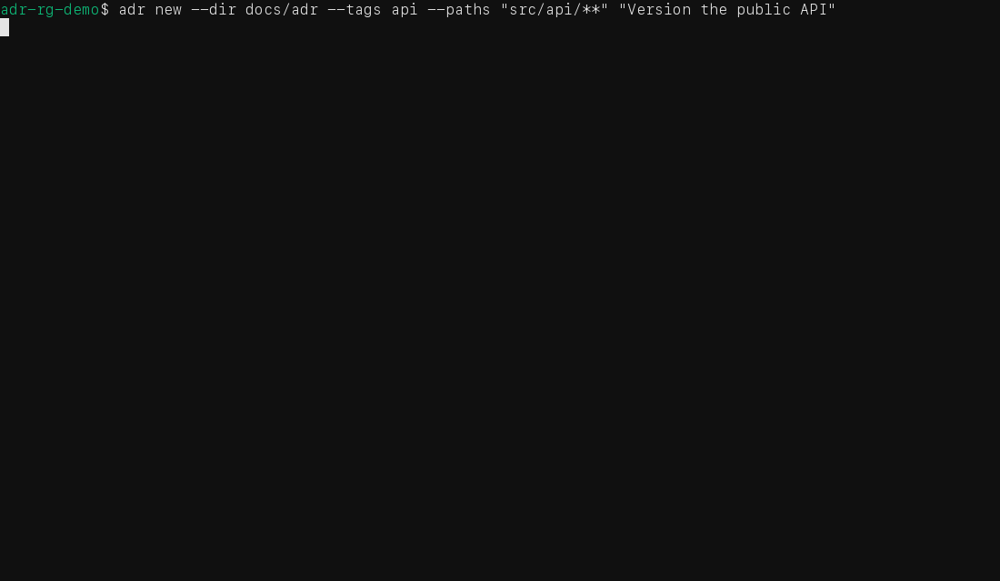
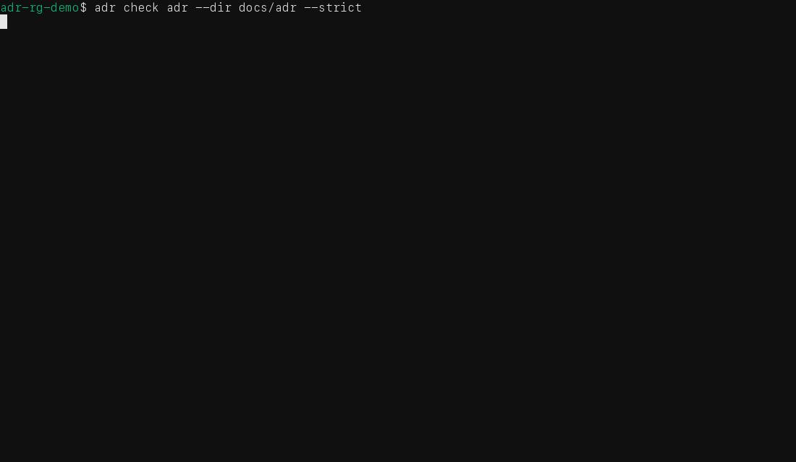
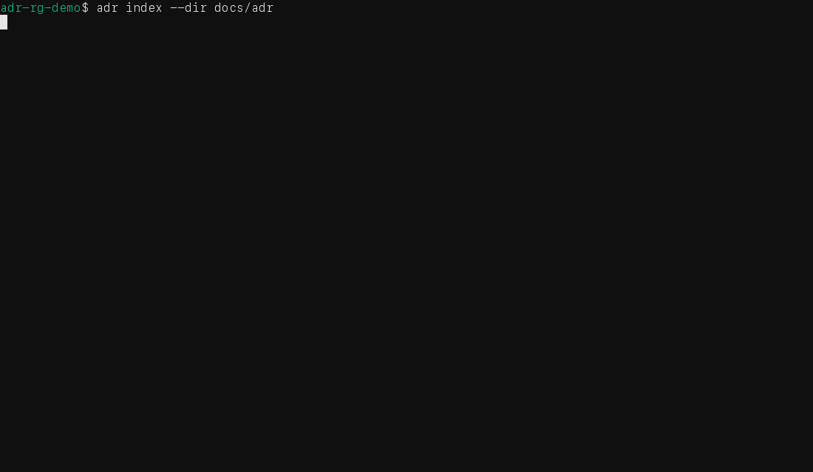
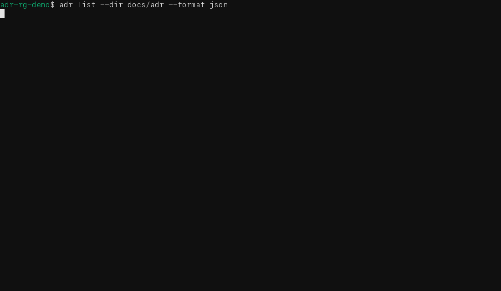
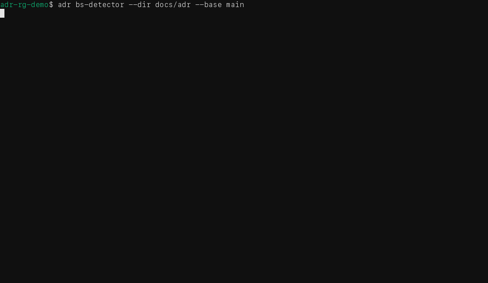

# ADR - RG

### A CLI for scaffolding agent-centric repositories and governing architecture decisions.

Architecture decisions should not disappear into a pull request, a chat thread, or one engineer’s memory. `adr` keeps them in Markdown, gives them useful metadata, and makes the relevant record easy to find when code changes.

It is deliberately small. An architecture assistant or engineering team chooses the design; `adr` stores the decision, validates the record, and points reviewers at decisions whose scope may have been touched.

Scaffolding includes standard `CLAUDE.md`, `AGENTS.md`, language guidance, and
editable Git defaults. The scope review command is `adr detect-bs`.

**Git-native ADR governance for teams that want decisions to survive the sprint.**

## Install

Install from source:

~~~bash
go install github.com/averyfreeman/adr-repo-governance/cmd/adr@v0.2.0
~~~

From a checkout, install into the XDG user-space layout:

~~~bash
make install
~~~

The default application data directory is `~/.local/share/adr-rg`, and the
`adr` symlink is created at `~/.local/bin/adr`. Set `XDG_DATA_HOME`,
`XDG_BIN_HOME`, or `prefix` to override the paths. On macOS, use
`make install-mac-layout` to place application files under
`~/Library/Application Support/org.unixgreybeard.adr-rg`.

Check the binary:

~~~bash
adr version
~~~

Build the lightweight Alpine container from the current version tag:

~~~bash
make build-container
make publish-container
~~~

The default image is `averyfreeman/adr-repo-govern`; set `DOCKER_USERNAME` or
`CONTAINER_USERNAME` to publish under another registry account.

## Scaffold a repository

Generate the default instruction files and language guidance without
initializing Git or contacting a remote:

~~~bash
adr scaffold --lang rust
adr scaffold -l go -d ./new-project
~~~

The generated `.adr-scaffold.yaml` records editable defaults for version tags,
commit conventions, pushes, remotes, and other Git habits. Existing files are
resolved interactively; use `--force` when blind replacement is intentional.

## Create and query ADRs

Initialize the repository, create a decision, and query the records that cover a
path:

~~~bash
adr init
adr new --tags database,storage --paths "src/db/**,migrations/**" "Use PostgreSQL for persistence"
adr list --path "src/db/users.go"
adr show ADR-0001
~~~

`adr new` creates a stable ID and refreshes the generated index unless
`--no-index` is supplied. Scope paths are deliberately explicit: they tell the
next reviewer where a decision might matter.

## Validate ADRs

Run the normal check while editing, then use strict mode in CI:

~~~bash
adr check adr --strict
~~~

The check covers frontmatter, required sections, and the repository’s rationale
rules. It catches a malformed decision document before it becomes somebody
else’s archaeology project.

## Keep the index honest

The index is generated metadata, not a second source of truth:

~~~bash
adr index
adr index --check
~~~

Use `adr index` after ADR metadata changes. Use `adr index --check` in CI to
fail when the committed index no longer matches the records on disk.

## JSON for automation

Text is for people at a terminal. JSON is the stable integration surface for
plugins, scripts, CI, and architecture tools:

~~~bash
adr list --format json
adr show --format json ADR-0001
~~~

The JSON output exposes ADR identity, status, dates, scope, constraints,
invariants, and the result-specific fields returned by each command. The
on-disk index remains YAML because it is generated repository metadata that
people review in Git.

## Bullshit Detector

The **Bullshit Detector** is the memorable name for the practical bit: run
`adr detect-bs` when a change is ready for review.

~~~bash
adr detect-bs --base main
adr detect-bs --base main --format json
~~~

It compares changed Git paths with the `scope.paths` globs on proposed and
adopted ADRs, then surfaces the matching decisions, constraints, and invariants.
That is a review queue—not a semantic proof that the code complies. Read the
reported ADR and inspect the implementation.

## Command reference

| Command | Purpose |
| --- | --- |
| `adr init` | Create the ADR directory, template, and empty index |
| `adr new "Title"` | Create a numbered ADR |
| `adr list` | List ADRs with status, tag, and scope filters |
| `adr show <id>` | Show one ADR’s metadata, decision, and governance fields |
| `adr check adr` | Validate ADR files |
| `adr index` | Generate or check the YAML index |
| `adr detect-bs --base <ref>` | Find ADRs applicable to changed Git paths |
| `adr scaffold --lang <name>` | Generate a language-specific project scaffold |
| `adr version` | Show version and build metadata |

Normal commands use `--format text` or `--format json`. `adr index` also accepts
`--format yaml`.

## The ADR model

ADRs live in `docs/adr/` by default. A record combines YAML frontmatter with a
small required Markdown body:

~~~yaml
---
adr_id: ADR-0001
title: "Use PostgreSQL for persistence"
status: proposed
date: 2026-01-16
scope:
  paths:
    - "src/db/**"
tags:
  - database
constraints:
  - "All database access must use the repository boundary"
invariants:
  - "Migrations remain reversible"
supersedes: []
superseded_by: []
related_adrs: []
---
~~~

Every ADR needs `Context`, `Decision`, `Alternatives Considered`, and
`Consequences`. Use constraints for rules the implementation must follow and
invariants for properties that must remain true. Supersede an old decision with
a new record; do not quietly rewrite the history.

## Documentation and development

- [Specification](SPEC.md)
- [Documentation portal](docs/README.md)
- [Getting started](docs/guides/getting-started.md)
- [Writing ADRs](docs/guides/writing-adrs.md)
- [CI integration](docs/guides/ci-integration.md)
- [Reference](docs/reference/README.md)
- [Demo](demo/README.md)

~~~bash
make test
make vet
make build
adr check adr --strict
adr index --check
~~~

Go 1.26 or later is required for local builds. Hosted CI is the cross-platform
packaging check.
